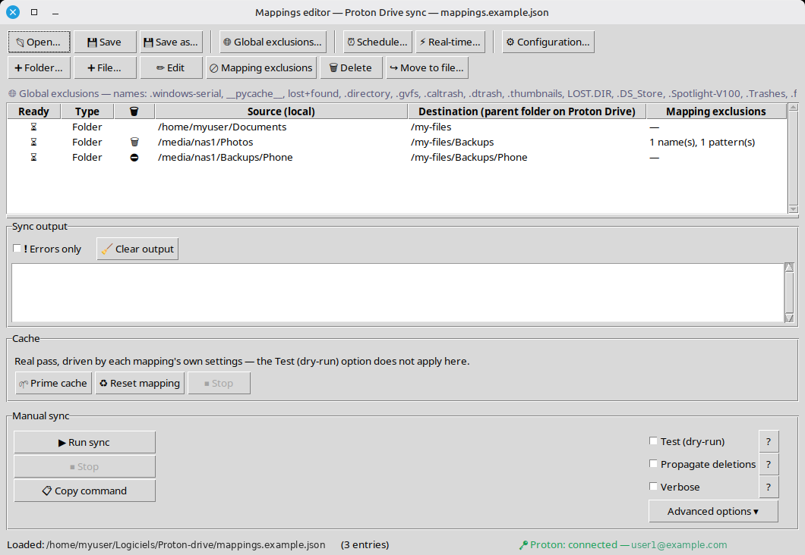
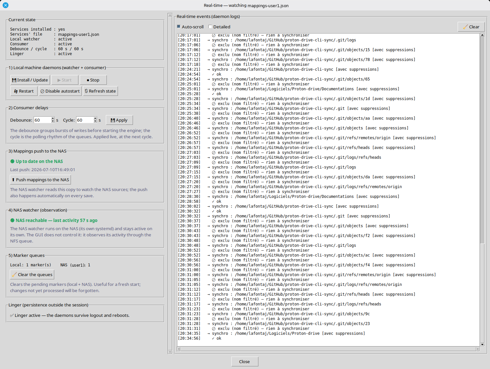
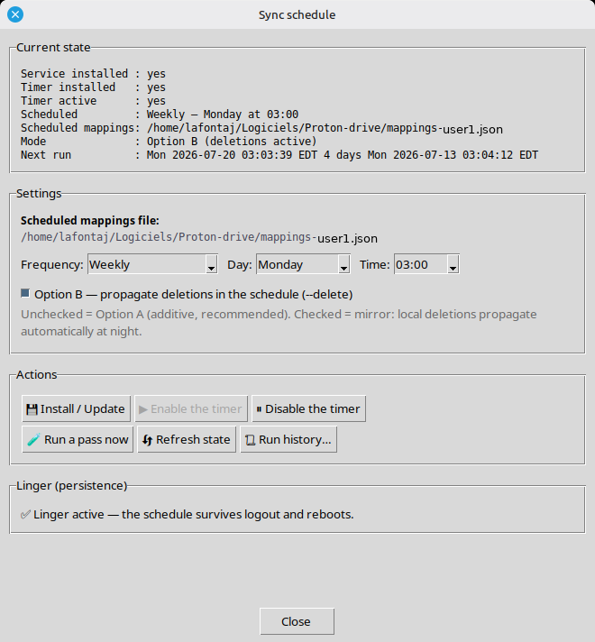
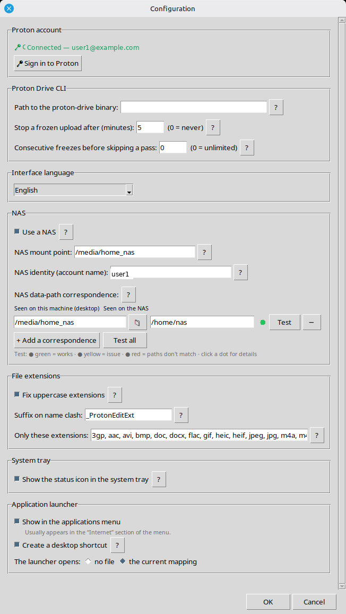

🇬🇧 English | 🇫🇷 [Français](README_fr.md)

# Proton Drive sync via the official CLI (Linux)

Reference document for this project.

---

## Screenshots

The mappings editor — the main window: folders to sync, per-mapping exclusions, the shared output pane, and the run controls.



The bottom of the window separates two kinds of action, because they do not obey the same options:

- **Cache** — *Prime cache* and *Reset mapping*. These are **always real passes**, driven by each mapping's own settings; the *Test (dry-run)* option does **not** apply to them, because the cache can only be armed by a real sync. The box has its own *Stop* button.
- **Manual sync** — *Run sync*, together with the options that affect only it: *Test (dry-run)*, *Propagate deletions*, *Verbose*, and the advanced options.

The output pane is shared by both, which is why its view controls (*Errors only*, *Clear output*) sit with the output itself.

The real-time window: daemon state, delays, NAS status, and the live event log.



The schedule window (the nightly systemd timer):



The configuration dialog — Proton account, CLI path, interface language, NAS settings, file extensions, system tray, and the application launcher (applications menu and/or desktop shortcut, opening the editor empty or on the current mappings file):



---

## Background

In June 2026, Proton released an **official CLI** for Proton Drive (`proton-drive`), available on Linux, macOS and Windows. It is the logical successor to the temporary WinBoat + iSCSI + robocopy bridge set up previously (still documented in `Guide-ProtonDrive-iSCSI-WinBoat.pdf`).

**Important CLI limitation**: it is **not** a continuous sync engine. It is a low-level tool for atomic operations (upload, list, info, etc.), meant to be called from scripts or cron jobs. The real graphical application with a built-in sync engine is announced for later in 2026.

**Solution developed here**: a Python engine (`proton_sync.py`) that orchestrates the CLI to obtain behavior equivalent to `robocopy /MIR` — detecting new/modified files, without blindly re-uploading everything on each pass. Plus a Tkinter graphical editor (`proton_mapping_editor.py`) to manage the list of folders to synchronize.

**Status as of July 15, 2026**: the engine is fully functional and validated (first complete pass on User1, ~2960 folders in cache, and on User2). A **real-time synchronization layer** (inotify watching + systemd daemons, driven by the GUI) now sits on top of the batch engine and syncs as soon as a file changes; the scheduled batch becomes a **safety net** (weekly). systemd automation operational for both profiles. Exclusion system implemented. The project is in production. Recent hardening validated under real conditions: authentication short-circuit (no more "exit code 2" noise while the keyring is locked), automatic retry of the scheduled pass on a lock collision with real-time, and a **mount-aware** local watcher (catches up NAS sources mounted late at boot, and tracks mounts going down/up during the session).

**Works without a NAS.** The NAS is entirely optional: a fresh install starts in **local-only mode** (folders sync straight to Proton Drive, no NAS involved). Enabling a NAS is an explicit choice in the settings. When a configured NAS becomes unreachable (reboot, network), the daemon **suspends only the NAS mappings and keeps local mappings syncing**, then resumes automatically once the NAS is back — no freeze, no lost changes (NAS-side markers are preserved and a full re-scan runs when the NAS watcher restarts).

**Other recent additions**: an end-to-end **NAS path-correspondence self-test** (coloured status dots per mapping, with a warning before adding an unvalidated NAS mapping); a discreet **upload indicator** while a batch is being sent; **copy-to-clipboard** buttons for the shell commands shown in dialogs; a non-blocking NAS reachability probe so the real-time window never hangs when the NAS is down; and a **NAS script drift alert** (an "!" badge on the tray icon and a warning in the window) that flags — without pushing anything on its own — that a deployment to the NAS is still pending.

---

## Target environment

- **Machine**: Linux Mint desktop, hostname `mypc`, user `myuser`
- **NAS**: Ubuntu, IP `192.168.1.10`, NFS-mounted under `/media/nas1/`
- **Proton account**: `you@proton.me`
- **Proton Drive CLI**: `/home/myuser/Logiciels/Proton-drive/proton-drive`
- **Official download**: <https://proton.me/download/drive/cli/index.html>
- **Tested CLI version: 0.5.0.** The CLI's behaviour changes between releases, and only this one has been validated here — from 0.5.0 the media type is detected correctly even with an uppercase extension, and items can be trashed inside a "Shared with me" folder. The application checks the installed version at startup and warns if it differs (older *or* newer), offering to quit so you can install the tested one. The engine, which also runs unattended from timers, only logs a warning and never stops a pass.
- The CLI depends on **libsecret** and the `org.freedesktop.secrets` service (GNOME keyring, already active on Mint with a graphical session). Credentials are stored under the service `ch.proton.drive/drive-sdk-cli`.

**Replacing the CLI binary.** Linux refuses to overwrite an executable that is currently running (`Text file busy`), and the sync engine may well be mid-pass. Rename the old binary instead of overwriting it — renaming succeeds even while it is in use, running processes keep the old inode, and the next launch picks up the new one:

```bash
cd ~/Logiciels/Proton-drive
mv proton-drive proton-drive-0.4.6      # frees the name, disturbs nothing
cp /path/to/new/proton-drive proton-drive
chmod +x proton-drive && ./proton-drive --version
```

Keeping the previous binary around also gives you an instant rollback. The application caches the detected version keyed on the binary's fingerprint, so a replacement is picked up automatically on the next run — nothing to clear.


### For User2's account

Since the CLI only supports one active account at a time (credentials live in the keyring of the current Linux user), the chosen solution is: **two separate Linux accounts** on the same Mint machine, each with its own graphical session and its own keyring. No Windows VM nor second container needed — Linux natively handles multi-user sessions without the Windows Home/Pro limitation.

The lock (see below) uses `~/.proton_sync.lock` (in each user's home) and the cache `~/.proton_sync_cache/` — so User1 and User2 can run **simultaneously** from their respective sessions without interference.

---

## Roots available on Proton Drive

`filesystem list /` returns the account roots:

```
/my-files               <- main personal space (the one we use)
/devices                <- files deposited by the official sync clients
                           (contains "Windows DESKTOP-01" and "Windows MYPC_VM"
                            from previous WinBoat installations)
/shared-by-me
/shared-with-me
/trash
/albums
/photos
/photos-shared-by-me
/photos-shared-with-me
/photos-trash
```

**Decision**: we sync to `/my-files`, not `/devices`. The `/devices` section is reserved for official sync clients (each subfolder carries its own machine metadata). Writing there via the CLI would risk conflicts once the native Linux client ships. `/my-files` is the canonical, stable space. Sharing with User2 happens through the web interface from `/my-files`.

### Syncing into a "Shared with me" folder

A mapping can also target a folder someone shared with you (`/shared-with-me/...`) — for instance a collaborative space with one subfolder per person. What works there depends on the CLI version:

- **CLI 0.5.0 and later**: uploads, in-place updates and **deletions** all work. A deleted item goes to the **owner's** trash, not yours.
- **Older CLI**: deletions are not supported there. The mapping editor detects such destinations and locks the mapping to upload-only — not out of caution, but because each attempt would fail one by one while walking down the tree, needlessly lengthening the pass.

> **⚠ Deletion on a shared folder is potentially destructive.** With deletion enabled, everything inside **that destination folder** (and its subfolders) that is missing locally is deleted and sent to the **owner's trash** — including files other people put there. Only that folder is affected, not the rest of the Drive. Only enable it on a folder you are the sole contributor to, as a one-way delivery to its owner. Any other use risks erasing someone else's work. The application asks for an explicit confirmation when you enable deletion on such a destination, and again if you ask a reset to empty its remote folder.

Two things are unchanged regardless of version. If the owner granted read-only access, nothing can be written at all: rather than attempting every file and failing on each one, the engine stops that mapping at once with a single message inviting you to request access — the rest of the pass continues normally. And top-level locations (`/my-files`, `/shared-with-me`, `/photos`, `/devices`) are fixed virtual roots: they always exist and cannot be created, so the engine never tries and simply descends into them.

---

## CLI validation

Tests performed before developing the engine:

- **Connection via NFS**: a file on `/media/nas1/...` uploads without issue; the CLI treats NFS paths as local paths. Validated in practice on the full pass.
- **`upload --file-conflict-strategy replace`** retransfers the file unconditionally, **with no smart detection**: 8.8 seconds measured for a 24 KB file already identical on the server. That's what justifies an upstream engine deciding what to upload.
- **`filesystem list -j`** returns usable JSON.

### JSON structure returned by the CLI

Key fields to extract (nested `{ok: true, value: ...}` wrappers must be unwrapped):

```json
{
  "name": {"ok": true, "value": "file-name.pdf"},
  "type": "file",
  "totalStorageSize": 1500256,
  "modificationTime": "2026-05-29T16:44:25.000Z",
  "activeRevision": {
    "ok": true,
    "value": {
      "claimedSize": 1500196,
      "claimedModificationTime": "2016-02-29T21:42:04.000Z",
      "claimedDigests": {
        "sha1": "3910e3b8a6898cd995dd324f1cf1a65581b5c516",
        "sha1Verified": false
      }
    }
  }
}
```

**Important pitfalls** (confirmed in practice):

- `totalStorageSize` = the **encrypted** size stored on Proton's side (encryption overhead). Does **not** match the local size of the original file. **Do not use for comparison** — that was an initial bug that re-uploaded everything.
- `activeRevision.value.claimedSize` = the size of the original file as declared by the client at upload time. **This is the value to compare** against `os.path.getsize(local)`.
- `claimedDigests.sha1` = SHA1 hash of the original content. Enables content verification independent of the modification date (useful to detect music tag changes that preserve date and size).

### Useful CLI commands

```bash
# Authentication (opens the browser)
./proton-drive auth login

# List the account roots
./proton-drive filesystem list /

# Folder creation (parent + name as two separate arguments)
./proton-drive filesystem create-folder /parent/path FolderName

# List with JSON output
./proton-drive filesystem list -j /remote/path

# Upload with conflict strategy
./proton-drive filesystem upload -f replace -d merge file1 file2 /remote/path
```

Available conflict strategies: `merge`, `keep-both`, `replace`, `skip`. `-f` for files, `-d` for folders, `-c` for both.

---

## Architecture

```
mappings-user1.json          <- list of folders to synchronize
mappings-user2.json           (one file per profile, edited via GUI or by hand)

proton_mapping_editor.py    <- Tkinter GUI (JSON editing, launching, scheduling, real-time)
proton_sync.py              <- batch sync engine (core)
mount_check.py              <- mount safety guard (mandatory for deletions)
schedule_manager.py         <- GUI backend for the nightly timer (systemd --user)

# Real-time layer
local_watcher.py            <- inotify watcher for local sources (local machine)
nas_watcher.py              <- inotify watcher for NAS sources (runs on the NAS)
realtime_consumer.py        <- consumer: reads markers, debounces, launches the engine
realtime_manager.py         <- GUI backend for real-time (daemons, config, NAS push, queues)
proton-nas-watch.service    <- systemd unit for the NAS watcher (to install on the NAS)

~/.proton_sync.lock         <- lock (created automatically, per user)
~/.proton_sync_cache/       <- folder fingerprint cache (per mappings file)
~/.proton_sync/queue/       <- real-time marker queue (local)
~/.proton_sync/realtime.conf<- real-time settings (debounce, cycle) — written by the GUI
/media/home_nas/proton-sync/ <- NAS side over NFS: config/ (pushed mappings) + queue/<account>/
```

### Mappings file format

TWO accepted formats (backward compatibility):

**Old format** — plain list (still supported):

```json
[
  {
    "type": "folder",
    "source": "/media/nas1/Documents/Vers_Proton/Communs",
    "dest_parent": "/my-files"
  },
  {
    "type": "file",
    "source": "/media/nas1/Conteneurs/Veracrypt-e1",
    "dest_parent": "/my-files/Sauvegardes/Conteneurs"
  }
]
```

**New format** — object with optional exclusions:

```json
{
  "exclusions": {
    "names": [".caltrash", "trash", ".Trash-1000"],
    "patterns": ["*.tmp", "~*"]
  },
  "mappings": [
    {
      "type": "folder",
      "source": "/media/nas1/Documents/Vers_Proton/Communs",
      "dest_parent": "/my-files",
      "exclusions": { "names": [".specific-to-this-mapping"] },
      "allow_delete": true,
      "delete_mode": "trash",
      "source_kind": "nfs"
    }
  ]
}
```

- `type: folder` -> the folder's entire content is synchronized recursively.
- `type: file` -> a single file (useful for VeraCrypt containers — a deliberate per-file whitelist choice, so a new sensitive container added later never ends up on Proton by accident).

**Deletion fields (optional, per mapping)** — see the "Deletion propagation" section below:
- `allow_delete`: `true`/`false` (absent = false = additive, never deletes). Allows this mapping to propagate local deletions to Proton.
- `delete_mode`: `"trash"` (Proton trash, recoverable for 30 days) or `"permanent"` (definitive, irreversible). The mapping's mode is authoritative.
- `source_kind`: `"nfs"` or `"local"`. Auto-detected by the GUI, confirmed when editing. Used by the safety guard: an `nfs` source only deletes if the network mount is alive.

### Exclusions

Two combined mechanisms, applying to **folders AND files**, by **name** (not full path):

- `names`: EXACT names, case-insensitive (e.g. `.caltrash`, `trash`, `.Trash-1000`)
- `patterns`: shell-style glob patterns, case-insensitive (e.g. `*.tmp`, `.Trash-*`, `~*`)

Two cumulative levels:
- **Global**: apply to all mappings
- **Per mapping**: add to the global ones, for that mapping only (the `exclusions` key inside the entry)

An excluded folder is not visited at all (its entire content is ignored). An important deliberate nuance: we do NOT blindly exclude all hidden files (starting with `.`) — a wanted `.important_config` is kept, while an explicitly listed `.caltrash` is excluded.

**Automatic cleanup with `--delete`**: a file excluded locally but already present on Proton (uploaded before the exclusion was added) is seen as an **orphan** at the next `--delete` pass and goes to the Proton trash (recoverable for 30 days). The **cache signature embeds a fingerprint of the exclusion set**: any exclusion change invalidates `delete_synced` and forces reconciliation at the next `--delete` pass — cleanup is therefore automatic, no "Ignore cache" needed. Trade-off: that first pass after an exclusion change re-checks every folder (slower, once), then fast skips resume. Keep in mind: refine your exclusions if you want to keep on Proton certain files excluded locally — what you exclude eventually disappears from the backup.

**Real-time safety guard (`sync_subpath`)**: when the watcher targets a subpath directly, the engine tests **every segment** of the path relative to the mapping root — the target itself (`__pycache__`, `logs`) **and its ancestors** (`.Trash-1000/info` is skipped because `.Trash-1000` matches `.Trash-*`). The engine then emits a line carrying the **stable tag `[subpath-excluded]`** (language-independent), which the consumer detects to display "🚫 excluded (name filtered) — nothing to sync" instead of an ambiguous "✓ ok". No upload, no remote creation, no deletion for those paths.

Exclusions are managed visually in `proton_mapping_editor.py` ("Global exclusions" and "Mapping exclusions" buttons). A catalog of recommended patterns per application is maintained separately in `Temporary-files-exclusions.md`.

---

## Engine behavior (`proton_sync.py`)

### Detection logic

For each local file, the engine runs `filesystem list -j` on the remote folder (once per folder), retrieves `claimedSize` and compares it to `os.path.getsize(local)`. If the sizes differ, upload. If the remote size field is missing, **upload to be safe** (prefers uploading too much over missing a change).

With `--verify-hash`, it adds a SHA1 comparison when sizes match — detecting content changes without size changes (equivalent of robocopy's monthly `/MIR /IS`). **Warning**: reads every file in full (slow on large volumes) AND bypasses the cache. Reserve it for a periodic check, not daily use.

### Local cache (major optimization)

**Problem solved**: without a cache, the engine makes one `filesystem list` call per visited folder, at ~1-2 s each. On User1's tree (the `Communs` folder alone contains **1890 subfolders**), a "nothing to do" pass would take tens of minutes to several hours.

**Solution**: `~/.proton_sync_cache/<mapping_name>.cache` (JSON). For each successfully synced folder, we store a fingerprint: the folder's mtime + the sorted list of (name, size, mtime) of its direct files. On the next pass, if the local fingerprint is identical -> we **skip the CLI call entirely** ("⚡ cache valid") and just descend into subfolders. Result: a no-change pass drops from hours to seconds.

**Safeguards**:
- The cache is NEVER a source of truth, just a shortcut. Deleting it forces a full re-scan.
- A folder with a failed upload is NOT cached -> automatically retried at the next pass.
- `--dry-run` never touches the cache.
- Atomic writes (tmp + rename) -> never a corrupted cache, even on a crash.
- `--ignore-cache` forces a full pass (and rebuilds the cache on the fly, entry by entry).

### Checkpoints (crash resilience)

The cache is saved to disk **after each processed mapping entry** (not only at the end). So if the machine crashes or gets a `kill -9`, all the work of already-processed mappings is kept, and the resume skips what is already cached. Tested with `kill -9` mid-pass: clean resume.

### Lock (no simultaneous runs)

`flock` on `~/.proton_sync.lock`. Prevents two engine instances from running at the same time **under the same user** (e.g. cron firing during a manual pass). The lock is released automatically by the OS at process end — clean exit, kill, Ctrl+C or crash — so no orphan lock. Since it lives in the user's home, User1 and User2 (separate Linux sessions) never block each other.

### Automatic folder creation

`ensure_remote_path()` walks the remote path segment by segment and creates each missing folder via `filesystem create-folder`. Recursive: each newly discovered local subfolder triggers the same check on the remote side. No manual pre-creation required.

### Deletion propagation (`--delete`) — optional true mirror

By default, the engine is **additive**: it sends new and modified files, but never deletes anything on Proton. That's a safety net (deleting a file from the NAS doesn't lose it on Proton). The `--delete` mode turns it into a **mirror**: what disappears locally also disappears on Proton.

**Two-level model (important)** — a deletion happens ONLY if BOTH conditions are met:

1. **`--delete` at launch** (the master switch). Without this flag, NO deletion, regardless of the JSON.
2. **`allow_delete: true` on the mapping** (in the JSON, set via the GUI). Without it, that mapping stays additive even with `--delete`.

This double level is deliberate: the JSON declares the intent, the command line arms the mechanism. It prevents a deletion from firing by accident (e.g. a routine scheduled pass).

**Deletion mode** — set per mapping via `delete_mode`:
- `"trash"` (default): sent to the Proton trash, recoverable for 30 days.
- `"permanent"`: definitive deletion, irreversible. The mapping's mode is authoritative once `--delete` is active (no second flag).

**Mount safety guard (`mount_check.py`)** — the key protection. Before any deletion in a mapping, the engine verifies that the source is "healthy" according to its `source_kind`:
- If `source_kind: "nfs"`, the source MUST currently be backed by a live network mount (nfs/nfs4). If the NAS is disconnected, the path falls back to local (ext4) and appears empty — the engine detects the inconsistency and **blocks all deletions** in that mapping (uploads continue). That's what prevents the catastrophe "NAS down → everything seems deleted → the backup gets emptied".
- If `source_kind: "local"`, we just require the source to exist and be readable.
- If the kind is not declared, or if `mount_check.py` is missing from the folder: deletion refused for safety.

**`mount_check.py` MUST live next to `proton_sync.py`** (same folder). Without it, all deletions are refused (safety guard).

**Cache interaction (the `delete_synced` flag)** — to keep the cache's speed in `--delete` mode, each cache entry carries a flag saying whether the remote side has already been reconciled (orphans handled) during a `--delete` pass. Consequences:
- The **first** `--delete` pass checks the whole remote side (slower), then marks folders as reconciled.
- **Subsequent** `--delete` passes skip folders that are unchanged AND already reconciled (fast, like a normal pass).
- A local deletion changes the folder's fingerprint → it is re-checked at the next `--delete` → the orphan is propagated.
- A pass WITHOUT `--delete` does not mark folders as reconciled → a later `--delete` will catch a deletion made in between. (Backward-compatible with old caches, migrated on the fly.)

**No mass-deletion guard**: a deliberate choice. A local deletion is considered intentional, and the window between two passes (point-in-time sync, not continuous) plus the 30-day trash are sufficient safety nets. The only guard is the mount one (technical failure, not human decision).

**`file` mappings**: a single-file mapping whose source disappears locally sees its remote copy deleted too (if `--delete` + `allow_delete`). To keep a file on Proton while removing it from the NAS: remove its mapping entry before the next pass (the order of operations between two passes doesn't matter).

**Recommended test before enabling**: always run `--delete --dry-run` first to see what would be deleted, without erasing anything.

### Real-time logging

The engine forces immediate output flushing (`line_buffering`), so with `| tee file.log` the log fills live (not in big blocks at the end). No need for the `-u` flag anymore.

### Error handling

- Local source not found -> skipped, message printed, processing continues.
- Upload failure -> error message, the engine continues with other files, and the folder is not cached (retry at next pass).
- **Proton API 500 errors**: observed during the first pass (temporary server hiccups on `drive-api.proton.me`). Harmless — since the affected files are not cached, simply re-running the script catches them. Confirmed in practice: the 2nd pass caught every file missed in the 1st.
- Ctrl+C interruption -> safe: on the next launch, already-uploaded files are recognized as unchanged and skipped.
- **File names with glob metacharacters (braces, brackets…)**: the Proton CLI applies pattern expansion (glob) on local file paths passed to `filesystem upload`. A name like `{43ed69b5-...}.xpi` (typical of Thunderbird/Firefox extensions) is then interpreted as a pattern, matches no real file, and fails with "No paths matched". **Fix**: the engine automatically escapes the metacharacters `{ } [ ] * ?` by wrapping them in literal glob classes (`{` → `[{]`, etc.) before handing the path to the CLI. This is a Proton CLI bug (it should not glob explicitly provided paths) — worth reporting to Proton; meanwhile the workaround is transparent.

### Performance

- The CLI has a fixed cost per invocation (~1-8 s, mostly network/authentication latency).
- The engine **batches uploads** into a single call per folder (`upload f1 f2 f3 ... destParent`) to amortize that fixed cost.
- The first full pass on a virgin tree takes time (uploads + one `list` per folder). Subsequent passes are near-instant thanks to the cache.

### Usage

```bash
PROTON_DRIVE_CLI=~/Logiciels/Proton-drive/proton-drive \
python3 ~/Logiciels/Proton-drive/proton_sync.py \
~/Logiciels/Proton-drive/mappings-user1.json \
2>&1 | tee ~/Logiciels/Proton-drive/logs/sync-$(date +%Y%m%d-%H%M).log
```

Options:
- `--dry-run`: shows what would be done without transferring anything (and without touching the cache)
- `--verify-hash`: adds SHA1 verification (slower, reads every file; bypasses the cache; monthly use)
- `--ignore-cache`: forces a full re-check on the Proton side (rebuilds the cache on the fly)
- `--delete`: **master switch** for deletion propagation. Without it, no deletion. With it, every mapping with `allow_delete: true` propagates its local deletions to Proton, according to its `delete_mode` (trash/permanent) and subject to the mount guard. Always test with `--dry-run` first.
- `--subpath <folder>` + `--mapping-source <source>`: processes only **one subfolder** of a given mapping, instead of sweeping everything. Used by the real-time layer (the consumer launches the engine targeted at the folder that just changed).
- `--check-auth`: probes **only** authentication (is the keyring unlocked?) then exits — code 0 = OK, code 2 = locked. Doesn't take the lock, syncs nothing, doesn't touch the cache. Used by the real-time consumer to avoid launching passes doomed to exit code 2 while the session isn't open (reuses the engine's exact test, no duplicated logic).
- `-v` / `--verbose`: also shows `unchanged` files, cache skips, and the raw JSON of each folder's first element
- `--no-rename-ext`: **disables** extension normalization (see below; on by default).

### Upload robustness, thumbnails and MIME detection (extensions)

Three behaviors added after production observations. They target a backup whose **previews** are visible in Proton (web/mobile), not just recoverable files.

**1. Case-sensitive MIME detection on the extension — automatic normalization.** *Fixed upstream in CLI 0.5.0: the media type is now detected correctly even with an uppercase extension. On first launch with 0.5.0 or later the application therefore turns this normalization **off** and tells you why — renaming your own files is no longer needed. You can turn it back on if you want your extensions normalized anyway, or to repair older uploads sent with an uppercase extension; that choice is then kept for good. The description below applies to older CLI versions.* The Proton CLI derives the MIME type from the **extension**, but **case-sensitively**: a file named `DOC.PDF` or `IMG.JPG` (uppercase extension) is mis-typed (`application/octet-stream`), which breaks **thumbnail, preview AND icon** in the Proton apps at once — silently, with no error. Confirmed side by side: `doc.pdf`/`photo.jpg` (lowercase) get their type and preview, byte-identical `DOC.PDF`/`PHOTO.JPG` do not. Applies to images **and** PDFs (and presumably any preview-able format).
To fix this at the root **and** keep the cache coherent, the engine **renames the SOURCE**: any final extension containing uppercase letters is lowercased (`IMG_1949.JPG → IMG_1949.jpg`, base name unchanged). A single injection point (`sync_folder`) → covers **manual, priming/reset AND real-time**. Safety: directories and **excluded** files are never touched; on a **collision** with an existing target it **never** overwrites (suffix `_ProtonEditExt`, then a counter); `--dry-run` reports without renaming. **Scope (whitelist).** Since the only remaining purpose is to repair *older* uploads, and only preview-able formats ever had a thumbnail, normalization is limited to the extensions listed in `rename_ext_whitelist` (images, video, audio, documents — editable in ⚙ Configuration…). Renaming a router `.CFG` or a phone `.Backup` would modify one of your files without repairing anything — and if an external agent (a phone backup app, `rsync`…) recreates the original name on every pass, the collision guard turns an idempotent overwrite into an **unbounded pile-up**: one extra suffixed copy every night, on disk *and* on the Drive (observed in production, 12 copies of the same 6 KB file). An empty list means no restriction (historical behavior). **Duplicate suffixes** added by external agents are understood: `PHOTO.JPG (1)` is read as a photo and repaired to `PHOTO.jpg (1)`, the ` (1)` being restored untouched — without this, `splitext` yields an extension `.JPG (1)` that matches no list. Every rename is logged to `~/.proton_sync/renamed-extensions.log`. Disable with `--no-rename-ext`. Note: renaming a file previously uploaded with an uppercase extension leaves a remote orphan (old name), cleaned by any `--delete` pass.

> **Transient marker burst (real-time).** The *first* normalization of a tree renames many files at once; each rename is seen by the watcher as a pair of events (`DEL` of the old name + `ADD` of the new one), which drop real-time markers. This is **transient and self-resorbing**: on the next pass the files are already lowercase (no rename, no marker), and new files almost always arrive lowercase already. The consumer's **per-directory deduplication** also bounds the burst — ten files renamed in one folder = **one** sync of that folder, not ten. To avoid the burst entirely, do the first normalization via a **priming/reset** (`--delete` pass, consumer paused) rather than letting real-time discover everything.

**2. Thumbnails impossible for some formats (TIFF/HEIC/AVIF) — auto `--skip-thumbnails`.** Even with a lowercase extension, the CLI **fails thumbnail generation** for these formats on Linux (`Failed to generate thumbnails … format not supported … require the OS codec`), and that failure fails the **whole** batch upload. Installing system codecs (`libheif`, `libaom`, `libdav1d`, `libtiff`) does **not** help — verified: already installed, TIFF still fails; the CLI (TypeScript/Bun) doesn't use the system image libraries. Engine response: on that specific signature it **re-uploads the file with `--skip-thumbnails`** → the file is saved (intact, encrypted; viewable with a third-party viewer or after downloading), only Proton's **built-in** preview is missing. For an in-Proton preview, convert to JPEG/PNG. Affected files are logged `NO-THUMBNAIL` in the failures log, with the exact reason.

**3. Upload-failure isolation + dedicated log.** On a batch failure the CLI reports only a **count** (`N item(s) failed`), not the culprit — and the real reason is on **stdout** (not stderr). The engine then re-lists the remote (skipping what already landed), retries **file by file** to name the culprit and capture its exact reason, applies the auto-`--skip-thumbnails` above where relevant, and logs everything to `~/.proton_sync/failures.log` (`❌ FAIL` = genuine failure; `⚠ NO-THUMBNAIL` = uploaded without a thumbnail). The GUI has an **"❗ Errors only"** toggle that re-filters the output to error lines only.

**4. The CLI can freeze forever on an upload — engine-side circuit breaker.** Observed in production: on a 2 GiB upload the CLI stopped for **over 4 hours** at the very end of the transfer, holding the engine lock the whole time and stalling every other sync behind it, until a manual `kill`. Diagnosis: the CLI uploads 4 MiB blocks over a **pool of ~20 connections**; when one of them is dropped by an intermediate device during the quiet tail of a transfer, the reply never arrives, the process sleeps in `epoll_wait` and **no TCP timer is armed** — nothing at the network level will ever wake it. The engine therefore watches the upload it started (`Popen` + two pipe-draining threads; without them a full 64 KB buffer would block the CLI, creating the very problem being solved) and stops it after `cli_stall_minutes` of **total inactivity**, returning a failure so markers are kept and the folder is retried. What is sampled is `rchar` in `/proc/<pid>/io` (bytes read **by syscall**): `read_bytes` is unusable — the page cache serves the file, so it stays **frozen for minutes during a perfectly healthy transfer**. Instantaneous throughput does not discriminate either (a healthy final stretch still crawls at a few KB/min, same order as a freeze): **only duration separates them** — measured at 1 min 24 s for a healthy finalization, versus hours for a freeze. `cli_stall_max_kills` bounds *consecutive* attempts on the same destination: past the limit one pass is skipped and the counter resets — the folder is **never** permanently abandoned, since a backup that silently stops backing up is worse than the bandwidth it would save.

**5. A failed remote listing is no longer taken for an empty folder.** `filesystem list` returning nothing used to be indistinguishable from a genuinely empty folder, and the engine concluded "nothing is up there yet". Consequences: a whole folder **re-sent**; after a failed batch, every file retried one by one **including those that had landed**; a single-file mapping re-sent on every pass; in the GUI destination browser, "(no subfolder)" displayed **and cached**, so re-expanding the node changed nothing (you had to close and reopen the window); and the pre-deletion message announcing "**0 elements**" for a folder it had failed to count. The listing now carries whether the read succeeded, and each caller acts on it: the folder is skipped (nothing sent, nothing deleted, one journal line, retried next pass), the file is skipped, no blind batch retry, the count reports "not measured", and the browser **retries once** before showing a distinct message without caching the failure. Note the direction of the error was already safe: deletions are derived from what exists **remotely**, so an empty listing yields no deletion candidate — a marker only says *"look at this folder"*, it never names a file to delete.

**Observed matrix (three distinct levels).** "No thumbnail" ≠ "not viewable": the MIME type, the thumbnail and the built-in viewer are three separate things. Observed (with a correct lowercase extension):

| Format (lowercase ext) | Type / icon | Thumbnail | Built-in viewer |
|---|---|---|---|
| jpg / png / webp | yes | yes | yes |
| pdf | yes (PDF icon) | — (not an image) | yes |
| bmp | yes | **no** | **yes (opens)** |
| tiff / heic / avif | yes | no (codec) | no ("internal error") |

Cross-cutting rule: **everything depends first on a lowercase extension** (otherwise wrong type → no icon, no thumbnail, no preview). Then, whether a correctly-typed file gets a thumbnail or opens in the viewer depends on Proton's per-format support. BMP is the telling example: correct type, no thumbnail, but viewable.

---

## Current project status

- OK: CLI installed and authenticated on Mint (User1 + User2, separate Linux accounts)
- OK: upload test from NFS mount successful
- OK: `proton_mapping_editor.py` functional (mapping editing + integrated sync launch + exclusion management)
- OK: `proton_sync.py` calibrated on the real JSON output (claimedSize), with cache, checkpoints, lock, live log, auth check, exclusions
- OK: **first full pass succeeded** on `mappings-user1.json` (~2960 folders cached) AND on `mappings-user2.json`
- OK: 2nd pass validated — instant cache (~1m40 for User1 fully cached) + automatic catch-up of 500 errors
- OK: **systemd automation operational** — `--user` timers armed for User1 (3:00 am) and User2 (3:02 am), linger enabled for both
- OK: **exclusions** (trashes, temporary files) implemented and tested
- OK: **deletion propagation (`--delete`)** — mount guard (`mount_check.py`), trash/permanent modes per mapping, cache enriched with `delete_synced`, dry-run validated under real conditions
- OK: **glob fix** — file names with braces (Thunderbird extensions) now upload correctly
- OK: **real-time layer** — inotify watchers (local + NAS), marker queue, debouncing consumer, full chain validated in production on both profiles (local AND NAS sources)
- OK: **"⚡ Real-time…" window** — 5 sections (daemons, delays, NAS push + drift, NAS observation, queues) + live event log, auto refresh, screen-aware sizing
- OK: **systemd daemons** — `proton-watch` + `proton-consume` (`--user`, installed/driven from the GUI); `proton-nas-watch` (system, on the NAS, observed without SSH)
- OK: **auto push of mappings to the NAS** on save (+ version hash, drift indicator)
- OK: **adjustable schedule frequency** (daily / weekly / hourly) from the GUI; GUI-first timer install
- OK: **per-account NAS queue fix** (the consumer reads `queue/<account>` derived from the mapping, no more `$USER`); **per-mapping header** restored in the engine output
- OK: **authentication short-circuit** — while the keyring is locked, the consumer writes a single "waiting for session login" line and resumes at login (no more "code 2" bursts); `--check-auth` probe reusing the engine's test; **validated at reboot**
- OK: **scheduled pass retry on lock collision** — service switched to `Type=exec` + `Restart=on-failure` + `RestartSec=120` (bounded by `StartLimitBurst`): a collision with real-time no longer skips the nightly pass; installed for User1 + User2
- OK: **mount-aware local watcher** — immediate watching + adaptive re-scan: catches up NAS sources mounted late at boot, and tracks mounts going down/up during the session (`➕`/`➖`/`🔄` log lines); **validated in an actual boot race**
- OK: **real-time exclusion guard** — `sync_subpath` tests the target AND its ancestors (stable tag `[subpath-excluded]`), the consumer shows "🚫 excluded"; validated in production (`logs`, `__pycache__`, `.Trash-1000/info`)
- OK: **exclusion-aware cache** — the exclusion set fingerprint enters the signature: an exclusion change forces reconciliation at the next `--delete` (automatic cleanup of newly excluded orphans, e.g. `.dtrash`, `thumbnails-digikam.db`)
- OK: **"Run history" panel** — last run isolated by start boundary (reliable after a reboot), date picker, success/failure summary; validated (the July 1st collision is visible there)
- OK: **complete FR/EN internationalization** — GUI, engine, daemons, systemd descriptions; "🌍 Language…" selector, gettext catalog (379 messages), stable tag and multilingual markers for detections; validated in production in both languages
- TO DO (optional): decide whether to enable `--delete` in the schedule (see Option A / Option B below)
- TO DO (optional): schedule a periodic `--verify-hash` check (monthly /IS equivalent)
- TO DO (optional): clean up `.caltrash` files uploaded before the exclusions were added
- TO DO (deferred, User1's choice): exclusion-aware watchers; "show only what is synced" view in the real-time log

---

## Priming, subtree completeness and control (July 2026 session)

This section describes the behaviors added when full control from the GUI went into production. They all rest on one guiding principle: **real-time syncs day-to-day changes (targeted changes in already-known areas), while scheduling reconciles and builds the tree.** Real-time never builds a large unknown subtree.

### Subtree completeness (`subtree_complete`) — the core guardrail

The cache now records, per folder, a **`subtree_complete`** flag: true only if the folder was fully traversed without failure AND all its non-excluded children are themselves complete. Completeness **propagates bottom-up**: a complete root implies its whole tree is complete.

In real time (`--subpath`), the engine tests the completeness of the **parent** of the targeted subpath:
- If the parent is complete, a **new** folder created inside it is handled immediately (the reference cache exists).
- If the area has **not been analyzed yet** (an inherited "warm" root whose children were never traversed), real-time **defers to the scheduled pass** (exit code 3, "folder not analyzed yet — deferred"). It never launches a long discovery traversal.

A large, never-consolidated mapping therefore no longer blocks real-time: it waits for a full pass (priming or scheduling). This is the behavior that resolved the initial runaway of large mappings.

### Cache priming ("Prime cache" button)

The GUI can **prime** one or more selected mappings: a full `--delete` (trash) pass restricted to the chosen mappings via the new engine argument **`--only-source`** (repeatable). Priming sets `subtree_complete` and makes those mappings "ready for real-time" from the very first pass (deletion is operational immediately for mappings that allow it).

Orchestration is fully automatic and announced in the output:
1. Proton session check (hard stop if expired).
2. Stop the **consumer only** — the **watcher stays running**: real local changes on already-ready mappings keep being captured (markers kept, processed when the consumer returns) instead of being missed.
3. Pause the scheduled timer (non-destructive stop).
4. Prime with **visible progress**: count of analyzed folders (read from the cache) + current folder, streamlined display (one path per folder).
5. Restart the consumer, **re-arm the timer** (`restart` recomputes the next `OnCalendar` — a plain `start` would leave `Trigger: n/a`).
6. "X/Y mappings ready" summary.

With no selection, priming covers all mappings. Multiple selection is done with Ctrl+A / Ctrl+click / Shift+click.

### Per-mapping status indicator ("Ready" column ✅/⏳/—)

The mappings table shows a status column:
- **✅**: folder mapping ready for real-time (root `subtree_complete` AND current exclusion fingerprint identical to the one stored in the cache);
- **⏳**: to be primed (never analyzed, OR exclusions changed since consolidation — see below);
- **—**: file-type mapping (no tree to analyze, handled directly in real-time, no priming needed).

The indicator **recomputes the current effective exclusion fingerprint** (global + mapping-specific, reusing the engine's `Exclusions` class) and compares it to the cached one. Thus, **changing an exclusion immediately flips a mapping from ✅ back to ⏳**: a visual reminder that it must be re-primed. It refreshes on key events (edit mapping, add/remove a global or mapping exclusion, add/remove a mapping), **during priming** (mappings turn ✅ one by one — a per-mapping progress indicator), and via a slow timer (~30 s) to catch consolidations that happened outside the GUI (scheduling, real-time).

### Proton browser authentication ("Sign in to Proton" button)

CLI authentication is done **through the browser**: no credential passes through this software (password and 2FA stay between the browser and Proton). The GUI exposes a button that runs `proton-drive auth login`, streams its output (copyable fallback URL + success message) and updates a "connected / session expired" indicator.

- **Automatic detection** at startup and on window focus (debounced): the display never stays stale.
- **Source of truth = the real outcome.** The `--check-auth` probe (made independent of the mappings file) can return a false positive if the Proton CLI keeps a cached token. The engine therefore emits a **stable `[auth-failed]` tag** when a real pass fails to authenticate; the GUI detects it and corrects the indicator to "session expired", which then overrides the startup probe.

### Progressive cache persistence

The cache is written **incrementally** (throttled), and a signal handler (SIGTERM/SIGINT) saves it before exiting. An interruption (Ctrl+C, service stop, power loss) therefore **no longer restarts from zero**:
- On interruption: "⏹ Interrupted — cache progress saved" (shown only if the write succeeded, never a false promise).
- On startup over a populated cache: "↺ Resuming on an existing cache — work already recorded won't be redone" (covers a power loss where the interruption message could not be shown).

### Marker deduplication at write time

The watcher does not re-drop a strictly identical marker (same path AND same deletion intent) if one is already pending. Additions and deletions are never merged. A marker remains an **invitation to look** at a folder, never a guarantee of work: the disk state at processing time is authoritative.

### Unified streamlined display (priming + manual pass)

By default ("Detailed" unchecked), the GUI output shows only **one path per processed folder** (plus orchestration messages and errors), hiding the file-by-file detail and the CLI's technical output. Checking "Detailed" restores the full raw display. **The disk log always keeps the full output.** A "✓ Nothing to update" message avoids an empty screen when everything is already in sync.

### Infrastructure notes

- **Proton session/keyring.** The session token has a limited lifetime and the keyring (GNOME Keyring) may lock with the session. A scheduled pass that fires while the keyring is locked cannot authenticate (markers kept, nothing sent). For **unattended scheduled passes** (overnight), either prevent the keyring from auto-locking, or schedule during hours when the session is active and unlocked.
- **Scheduling is the safety net.** With `subtree_complete`, real-time defers not-ready areas; scheduling (or a manual pass) reconciles and builds them. Keeping a schedule active is therefore necessary for the whole to work — which has always been the role of the full pass.
- **systemd pitfall.** A `systemctl start` on an `OnCalendar` timer does not recompute its next trigger (state `Trigger: n/a`). Use `restart` to re-arm the calendar.


---

## Real-time synchronization

The engine above is **batch**: it sweeps everything on each pass. Since June 30, 2026, a **real-time layer** sits on top of it to sync **as soon as a file changes**, without waiting for the scheduled pass. The batch then becomes a simple **safety net** (see "Scheduling": weekly pass), while real-time handles the day-to-day.

### Principle and distributed watching

Watching relies on **inotify**, with a split between two watchers dictated by how inotify behaves on top of NFS:

- The **local-machine watcher** (`local_watcher.py`) watches the **local** sources (ext4) **and** the **NFS-mounted NAS** sources (`/media/nas1…`). It reliably captures everything written **from the local machine**, including in-place modifications.
- The **NAS watcher** (`nas_watcher.py`) watches the **NAS's local disk**. It captures what is written **directly on the NAS** (SFTP drops from a phone, local processes, other clients) — which the local machine cannot see.

The two are **complementary**. Subtlety: the NAS's inotify sees **structural** operations (create, delete, rename) performed by the local machine over NFS — because `nfsd` executes them as genuine local operations — but **not** in-place modifications, which only the local machine catches. A given structural operation can therefore be seen by both watchers; the consumer **deduplicates per folder**, with no double upload. Details in `INSTALLATION-realtime.md` ("Who sees what: the two watchers and NFS").

### Layered architecture

```
local_watcher.py     (local machine)  inotify on local AND NAS (NFS) sources -> markers
nas_watcher.py       (NAS)      inotify on the NAS local disk -> writes markers
                                 (shared queue, seen over NFS from the local machine)
realtime_consumer.py (local machine)  reads markers, debounces, deduplicates,
                                 launches the engine on the affected subfolder (--subpath)
realtime_manager.py  (local machine)  GUI backend: daemon install/control, config,
                                 NAS push, version drift, queues
```

### Marker queue

A **marker** is a small JSON file `{"path": "...", "delete": bool}` written by a watcher when a folder changes. For a deletion, the marker points at the **parent folder**: the engine notices the absence during the pass, needing no information about the vanished file.

- Local queue (local machine): `~/.proton_sync/queue/`
- NAS queue: `/home/nasuser/proton-sync/queue/<account>/`, seen over NFS on the local machine as `/media/home_nas/proton-sync/queue/<account>/`

**Identity = account name, not Unix login.** The `<account>` comes from the mappings file name (`mappings-user1.json` → `user1`) — a convention shared by the NAS watcher (which writes into `queue/user1`), the consumer (which reads there) and the GUI. This is deliberately **independent of the Linux login**, which can differ (e.g. `myuser` for the `user1` account): relying on `$USER` would read the wrong NAS queue. (Bug fixed: the consumer now derives the account from the mappings file, no more `$USER`.)

### The consumer (`realtime_consumer.py`)

Runs in a loop (cycle ~30 s):

- re-reads its config `~/.proton_sync/realtime.conf` (JSON `debounce_seconds`, `cycle_seconds`) **on every cycle** → live tuning, no restart;
- groups markers per folder, applies the **debounce** (lets write bursts settle before acting), merges conflicts with the rule **`delete=true` wins**;
- launches the engine on the single mature subfolder via `--subpath <folder> --mapping-source <source>` (and `--delete` if the mapping allows it) — so no full sweep, just what moved.

A marker is only deleted **after** a successful pass; a failure (typically the lock held by a manual pass) **keeps** the marker for retry at the next cycle.

### Pushing mappings to the NAS (+ version drift)

The NAS watcher must know the mappings to know which folders to watch. The GUI therefore **pushes** a copy of the active mappings file to `/home/nasuser/proton-sync/config/mappings-<account>.json` (the NAS watcher discovers accounts via `glob mappings-*.json` and hot-reloads). This push is **automatic on every save** of the mapping (and available on demand via a button). A **version hash** (sha256, in a `.version` sidecar) lets the GUI display the **drift**: 🟢 up to date / 🟠 local modified, not pushed / 🔴 NAS unreachable.

### Control window ("⚡ Real-time…")

Button in the GUI toolbar, next to "⏰ Schedule…". Five sections:

1. **Local-machine daemons**: install/update, start, stop, restart, disable autostart.
2. **Delays**: debounce + cycle (applied live).
3. **Mappings to the NAS**: manual push + drift indicator.
4. **NAS watcher (observation)**: reachability light + last activity (read-only).
5. **Marker queues**: count + cleanup.

Plus a **"Real-time events"** area that follows the daemons' journal live (`journalctl --user -f` on both units), and a **linger** reminder. The window auto-refreshes and adapts to the screen resolution (useful on User2's lower-resolution machine).

### Daemons and systemd

- **local machine**: two `systemd --user` services, `proton-watch.service` (→ `local_watcher.py`) and `proton-consume.service` (→ `realtime_consumer.py`), installed and driven **from the GUI** (the "Install / Update" button generates them, reloads systemd and enables them). `Restart=on-failure`, relaunched at session login.
  - **Mount-aware local watcher**: it immediately watches the sources already mounted (local ones right at startup) then **re-scans** the mounts — quickly at boot to pick up NAS sources as soon as they appear (a boot race no longer leaves it blind to the NAS for the whole session), then calmly to handle a mount going down or coming back during the session. Every change is logged (`➕` added, `➖` removed, `🔄` re-scan).
  - **Consumer and locked keyring**: if the session isn't open (keyring locked), the consumer launches no doomed pass; it writes **a single** "⏳ Waiting for session login" line, keeps the markers, and **resumes automatically** at login ("🔓 Session opened — resuming"). It probes authentication via `proton_sync.py --check-auth`, the same detection as the engine (no duplicated logic).
- **NAS**: one **system** service `proton-nas-watch.service` (under the `nas` account), installed **manually on the NAS** (starts at boot, no session needed). The GUI does not drive it — no SSH, no remote credentials — it **observes** it through the NFS queue. Each machine thus keeps its own daemons alive.
- **Linger**: required for the daemons (and the nightly timer) to run outside an open session. Displayed and reminded by the GUI; enabled with `sudo loginctl enable-linger <user>` (once, admin rights).

**Persistence across a reboot**: for real-time to restart at boot, three links must hold — network at boot, **NAS mounted at boot** (NFS mount in `/etc/fstab` with `_netdev`; a login-time mount would let the daemons start on empty mount points), and the keyring (which only unlocks at graphical session login). Without a session, markers pile up in the queue (nothing lost) and are processed at login. Even in a **boot race** (watcher started before the NFS mount is ready), the local watcher **catches up** the NAS sources as soon as they appear thanks to its re-scan (see above), so no source is lost for the session. Full details, fstab and check commands: `INSTALLATION-realtime.md`, "Persistence across a reboot".

Detailed installation: `INSTALLATION-realtime.md`.

### Interaction with the batch and the lock

Real-time, the scheduled batch and manual launches share the **lock** `~/.proton_sync.lock`: never two passes in parallel under the same user. If a manual pass holds the lock, the consumer **keeps** its markers and retries at the next cycle — safe behavior, observed in production (no loss).

The symmetric case on the **scheduled** side: if the real-time consumer holds the lock when the timer fires, the scheduled pass exits with failure (code 1). Its systemd service therefore uses `Type=exec` with `Restart=on-failure` + `RestartSec=120`: it **automatically retries ~2 minutes later**, once the consumer has finished and released the lock (bounded by `StartLimitBurst` to avoid any loop). Without this, a single collision was enough to skip the whole nightly pass. An exit code 2 (locked keyring) is still treated as success (`SuccessExitStatus=0 2`) and thus triggers no pointless retry.

### Known limitation (exclusions)

The watchers do **not** apply the exclusions: they write a marker for every change, and the **engine** does the filtering. Since the `sync_subpath` guard (see "Exclusions" above), a marker on an excluded path — the target or one of its ancestors — is **cleanly skipped** by the engine (tag `[subpath-excluded]`) and the log shows "🚫 excluded" instead of a misleading "✓ ok". So a bit of **marker noise** remains (one `→ sync` + `🚫 excluded` line per burst of excluded writes), but no upload nor remote folder creation anymore. Making the watchers **exclusion-aware** — never creating the marker at all — remains a **deferred** improvement (see "Future ideas").

---

## Automatic scheduling (COMPLETED)

**The known problem** (confirmed by Reddit threads on "PD CLI on Linux Desktop - Cron"): the CLI needs the secrets keyring unlocked, which **classic cron does not provide** (minimal environment, no graphical session, no keyring). The `bash -ic` workaround seen on Reddit sets environment variables but NOT keyring access — that's the real root of the problem.

**Chosen approach (better than cron), now in place**:
- **`systemd --user` timer** (not cron) — runs in the user's session context, with natural keyring access. Files `proton-sync.service` + `proton-sync.timer`, installed under `~/.config/systemd/user/`.
- **`loginctl enable-linger myuser` and `user2`** — so user services persist even without an active graphical login (enabled from User1's session, who is a sudoer; User2 is not).
- **Keyring unlocking**: chosen approach = **graphical session kept permanently open on the local machine** (a dedicated home mini-PC). The keyring stays unlocked, no security compromise.

**Handling a closed session (anti-blocking)**: the engine performs an authentication test (`filesystem list /`) at startup. If the keyring is locked (session not open), it exits cleanly with **code 2** and a clear message, uploading nothing and leaving the cache untouched. The service declares `SuccessExitStatus=0 2`, so systemd doesn't mark it as failed. The task retries at the next trigger (or as soon as the session reopens). No blocking, no corruption.

See the detailed guides `INSTALLATION-systemd.md` and `INSTALLATION-realtime.md` for the real-time layer.

**Install and tune from the GUI (main path)**: the "⏰ Schedule…" window installs/updates the timer in one click (it **generates** `proton-sync.service` + `.timer`, reloads systemd and enables the timer — no manual copying). It also lets you choose the **frequency**: daily, **weekly** (day + time of your choice), or hourly. Manual copying (`cp` of the units) remains documented as a fallback.

**Chosen systemd details**:
- `OnCalendar` **configurable from the GUI**: `*-*-* 03:00:00` (daily 3 am) originally; with the real-time layer covering the day-to-day, this pass now serves as a **safety net** and is happily set to **weekly** (e.g. `Sun *-*-* 03:00:00`).
- `Persistent=true` (catches up if the machine was off — precious for a weekly net: a missed pass replays at the next startup)
- `RandomizedDelaySec=300` (staggers User1 and User2 by a few minutes so they don't hit the API at the same time)
- `TimeoutStartSec=6h` (guard against a hang)

### Run history (GUI)

The **"📜 Run history…"** button (Schedule window) opens a panel to browse the scheduled service's journal — no dedicated log file: it reads the **systemd journal** (bounded and auto-purged, several months of history in practice).

- **Default view: the last run**, isolated by its **start boundary** (last "Starting/Started proton-sync.service" line in the journal) — reliable even after a reboot, unlike systemd's runtime state (`InvocationID`), which is wiped on every restart.
- **Summary at the top**: date + result ("✅ success", "❌ failure (code 1)" for a lock collision, "⏹ interrupted"). The detection markers recognize **both French and English** (the journal history stays readable after the i18n switch).
- **Date picker** (zenity calendar) to jump to a specific day.

This panel is what makes a skipped nightly pass (lock collision) visible at a glance — previously only spottable via `journalctl`.

### Deletion and scheduling: Option A (current) vs Option B

CRUCIAL point to understand: **setting `allow_delete: true` in the JSON is NOT enough for the schedule to delete.** The engine only performs deletion propagation when the `--delete` flag is passed at launch. The systemd service alone therefore controls whether the nightly schedule deletes or not — regardless of what the JSON contains.

**Option A — ADDITIVE schedule (current configuration, recommended at first)**

The systemd service launches the engine WITHOUT `--delete`:
```
ExecStart=/usr/bin/python3 %h/Logiciels/Proton-drive/proton_sync.py %h/Logiciels/Proton-drive/mappings-user1.json
```
Consequence: the 3 am passes are purely additive (they send, never delete). The JSON's `allow_delete: true` flags stay dormant at night. Deletions only propagate when the user launches manually with `--delete` (via the GUI by checking "Propagate deletions", or on the command line). This is the cautious mode: every deletion is controlled and watched.

**Option B — MIRROR schedule (automatic deletions at night)**

The systemd service launches the engine WITH `--delete`:
```
ExecStart=/usr/bin/python3 %h/Logiciels/Proton-drive/proton_sync.py %h/Logiciels/Proton-drive/mappings-user1.json --delete
```
Consequence: the 3 am pass becomes a true mirror. What is deleted locally disappears from Proton the following night (according to each mapping's `delete_mode`, and subject to the mount guard). Safety nets: the several-hour window before 3 am to notice a mistake, plus the 30-day Proton trash (for mappings in `trash` mode).

To switch from A to B: edit `~/.config/systemd/user/proton-sync.service`, append `--delete` to the `ExecStart` line, then:
```bash
systemctl --user daemon-reload
systemctl --user restart proton-sync.timer
```
**Prerequisites before switching to Option B**: several uneventful manual `--delete` passes, and `mount_check.py` present next to `proton_sync.py` (otherwise deletions are refused). To be decided separately for User1 and for User2.

**Current choice: Option A** (additive schedule, manual deletions only).

---

## Internationalization (i18n)

The project is **bilingual French/English**, via **GNU gettext** (standard Python module):

- **Source language = English** (the code's strings, `msgid`) — GitHub convention: future translators start from English. **French** is restored by the catalog `locale/fr/LC_MESSAGES/proton-sync.po` (the translation source, editable with Poedit) compiled into `.mo` (shipped binary).
- **Language resolution**, identical everywhere (GUI, engine, daemons) via `i18n.py`: **1)** explicit preference in `settings.json` (`{"language": "fr"}`) → **2)** otherwise the system language (`LANG`) → **3)** otherwise English. The **"🌍 Language…"** selector in the GUI writes `settings.json`; the change applies at the GUI's **next launch** and at the daemons' **next restart**.
- **NAS case (no GUI)**: the NAS watcher follows the NAS's system language; to force it, drop a `settings.json` next to it by hand (`echo '{"language": "fr"}' > /home/nasuser/proton-sync/settings.json`). Without `i18n.py`/`locale/`, nothing breaks: messages stay in English (guarded import, same pattern as `mount_check`).
- **External programs**: zenity (calendar) is launched with an adjusted locale environment (`i18n.subprocess_env()`) so its own UI follows the chosen language rather than the system's. Limitation: displaying a language requires its locale to be **generated** on the system (`locale -a`).
- **systemd unit descriptions**: generated **in the current language at "Install / Update" time**, then frozen inside the `.service`/`.timer` files (the nature of systemd) — redo an Install/Update after a language change to rewrite them.
- **`build_locales.sh`**: a **development** tool only (recompile the `.po` files after editing; requires the `gettext` package). Never required in production.

**Contributor notes** (lessons learned the hard way):
- **Never use `_` as a throwaway variable** (`ok, _ = f()`) in a marked file: it shadows gettext's `_` for the whole function (`UnboundLocalError`). Use `_err`, `_x`, etc. Systematic audit before shipping.
- **Detections decoupled from displayed text**: everything machine-parsed goes through **stable tags** outside translation (`[subpath-excluded]`) or **multilingual marker lists** (`"Terminé."`/`"Done."` in `_parse_result`) — never through the translated string alone.
- No `_(f"...")`: interpolation would happen before translation. Use `_("... {x}").format(x=...)`.

---

## Configuration (settings.json) and local-only mode

Since the "configuration" work package, everything that varies from one installation to another is **externalized in `settings.json`** (the same file as the language, next to the scripts) — nothing essential remains hard-coded. The **`config.py`** module is the single source of truth, shared by the engine, the GUI and the daemons (tolerant import: without it, every file falls back to its historical defaults).

**Available settings** (GUI dialog **"⚙ Configuration…"**, each with its own "?" help button written for non-programmers; or edit the JSON directly — see `settings.example.json`):

| Key | Default | Role |
|---|---|---|
| `language` | `"auto"` | Interface language (pre-existing, "Language…" dialog) |
| `nas_enabled` | `true` | **NAS mode switch.** When `false` (**local-only** mode), the application **never** tries to reach a NAS: no mappings push, no NAS queue polling in the consumer, NAS sections **hidden** in the Real-time window — a clean cut, not "try then fail" |
| `nas_mount_path` | `"/media/home_nas"` | NFS mount point where the NAS's `proton-sync/config` and `proton-sync/queue` live |
| `proton_cli_path` | `null` | Path to the Proton CLI binary. `null` = default resolution. Priority order shared everywhere: **`PROTON_DRIVE_CLI` environment variable > this setting > `<scripts folder>/proton-drive`**. When set, the generated systemd units use it too |
| `rename_ext_enabled` | `true` | Automatic uppercase-extension fixing (see the "Upload robustness…" section) — durably on/off; `--no-rename-ext` remains the one-shot override |
| `rename_ext_auto_disabled` | `false` | Internal: records that the one-time switch-off of extension normalization (CLI ≥ 0.5.0) has happened, so your own choice is never overridden afterwards |
| `rename_ext_collision_suffix` | `"_ProtonEditExt"` | Suffix inserted on a rename collision (never overwrites). Validated on input: non-empty, no `/ \ " '` |
| `rename_ext_whitelist` | images, video, audio, documents (37 entries) | Extensions the normalization is allowed to touch. Empty list = no restriction (historical behavior) |
| `cli_stall_minutes` | `5` | Minutes of total inactivity after which a frozen upload is stopped. `0` disables the circuit breaker |
| `cli_stall_max_kills` | `0` | Consecutive freezes tolerated on one destination before skipping a pass. `0` = unlimited |
| `tray_enabled` | `false` | Status icon in the system tray (see below) |

Changes apply at the **next launch** of the GUI and the **next restart** of the daemons (like the language). The file is written atomically and **preserves unknown keys**.

**Unified data folder.** The cache, the real-time queue and the logs now live under a single parent: `~/.proton-drive-sync/` (`cache/`, `queue/`, `realtime.conf`, `failures.log`, `renamed-extensions.log`, `proton_sync.lock`). On the first run after the update, an **automatic migration** renames the legacy locations (`~/.proton_sync_cache`, `~/.proton_sync`, `~/.proton_sync.lock`) into the new tree — a **rename** within the same filesystem: instantaneous, content untouched, **no cache re-scan**. Idempotent (several processes may start at the same time) and resilient (on failure, the legacy paths keep being used for the current run).

**Path hygiene.** The locations of the scripts themselves (engine, watchers, run logs) are **not** settings: each file derives them from its own location (`__file__`, as `i18n.py` always did). Installing the whole folder elsewhere (`/opt/…`, another home) works without configuring anything.

**Status icon in the system tray** (`tray_indicator.py`). A circular double arrow near the clock: **purple** = daemons running + Proton session valid; **purple with an amber "!" badge** = daemons running but NAS scripts are pending deployment (see "NAS script drift alert" below); **grey with a red X** = daemons running but session expired/keyring locked; **grey** = daemons stopped. (Priority: stopped > session expired > scripts pending > running.) Left click = open the editor; right click = menu. Enabled through the "System tray" checkbox in ⚙ Configuration… (immediate start + session autostart via `~/.config/autostart/`; on disable, the applet shuts itself down). Technically: XApp.StatusIcon (libxapp — native on Cinnamon/MATE/Xfce; packages `python3-gi` + `gir1.2-xapp-1.0`, preinstalled on Mint). The applet **never** contacts Proton: it only reads the `status.json` heartbeat the consumer rewrites every cycle in `~/.proton-drive-sync/` — zero extra probes, zero keyring contention. Accepted nuance: the consumer's auth probe only happens when there is work to do; when idle, the icon reflects the last known state.

**Stable NAS identity (`account_name`).** The configuration copy and marker queue on the NAS carry an identity **decoupled from both the mappings file name and the Proton account**: the persistent `account_name` setting. Default, seeded automatically at the right moment: the existing units' identity on an upgrade (historical installations preserved); otherwise, on a fresh install, a **neutral unique name `user{n}`** claimed on the NAS **at first real use** (first push or service installation) via `mkdir queue/user{n}` — an operation that is **atomic even on NFS**: two workstations bootstrapping at the same instant cannot win the same number. Customizable in ⚙ Configuration; if the old name exists on the NAS, the app then offers a **migration** (a simple rename of the queue and copy — markers preserved), and reminds you to restart the services. Whatever the local file is called, the push always writes `config/mappings-<identity>.json` and the consumer always reads `queue/<identity>`: **one real-time queue per person**, stable for life — renaming the local file is a non-event on the NAS side (no more ghost queues). Daemons never resolve the address themselves (the session may be locked when they start): they read the setting, seeded by the GUI.

**Proton account change (guard rail).** Every cache carries an **account stamp** (reserved `__meta__` key: the address of the account it was built for). At the start of a pass, the engine compares the stamp with the actually connected account: if they differ, it **refuses the pass** (code 4, `[account-changed]` tagged message, nothing touched) — trusting the cache would yield a silently incomplete backup, and ignoring it would re-upload everything unannounced. The way out: **"Prime the cache"** or **"Reset"** from the GUI (these actions pass `--accept-account-change` to the engine) — the old cache is discarded, re-stamped, and the destinations are (re)created on the new Drive. The real-time consumer recognizes the refusal: a single "⛔" waiting line in the journal, markers preserved, grey + X tray icon; automatic resume once resolved. **Old caches without a stamp remain valid as-is**, stamped along the way — no re-priming needed on an existing installation.

**Active file change (guard rail).** At "Install/Update", if the file differs from the one in the units, **every change asks for confirmation** (markers may arrive at any moment — no "zero pending" exemption): the dialog quantifies pending markers, **including those targeting folders NOT covered by the new file** — those will be discarded ("⊘" journal lines) and can only be recovered by reloading the old file for a manual or scheduled pass. Two outcomes: *Confirm the change* or *Cancel (keep the current file)*. The local queue self-cleans (marker with no mapping → ignored, visible "⊘" line); at startup, the NAS watcher reports (without touching) any orphan queue still holding markers — a possible historical leftover.

**Automatic script sync to the NAS.** On every real-time "Install/Update", the workstation pushes to `proton-sync/` on the NAS the files the NAS watcher depends on (`nas_watcher.py`, `local_watcher.py`, `config.py`, `i18n.py`, `mount_check.py` + `locale/`), as a differential copy (only changed files). This avoids the partial-deployment trap — a stale `config.py` on the NAS puts the service into a silent crash loop. The `.service` file is not installed remotely (that needs sudo): it is only **dropped** as `nas_watcher.service.new`, and if its content changed, the install message reminds you of the command to run on the NAS (`sudo systemctl daemon-reload && sudo systemctl restart proton-nas-watch.service`).

**NAS script drift alert.** Since "Install/Update" is no longer used day to day (the daemons reload themselves), nothing flagged that a script deployment to the NAS was still pending — the NAS could silently keep stale code. The consumer therefore periodically compares (at startup then every ~5 min, only when the NAS is reachable) the workstation's scripts and catalogs against their NAS copies — by sha256, over the exact same files the push would copy — and records the verdict in `status.json`. On a mismatch: the **tray icon** switches to the purple motif with an **amber "!" badge**, and the **real-time window** shows a warning in section 4 ("⚠ NAS scripts out of date — run Install/Update to push them, then restart the NAS watcher"). Both displays read the **same field** (a single source of truth). A single click on **Install/Update** pushes the files; the next check, seeing them in sync, **clears the alert on its own** (the push happens **before** the daemons restart, so the consumer's startup check already sees the NAS up to date). The alert never lights up in local-only mode or when the NAS is absent — nothing to push by design.

**NAS side**: `nas_watcher.py` no longer has a hard-coded prefix list (`/media/nas1`…) — it filters on the **`source_kind == "nfs"`** field already present in every pushed mapping (same information, zero duplication). Its base folder remains configurable via `--config-dir`/`--queue-dir`.

---

## Project reference files

The project's main files:

- `Guide-ProtonDrive-iSCSI-WinBoat.pdf` — the previous solution (WinBoat/iSCSI), still functional, kept as backup until this new setup is proven
- `proton_mapping_editor.py` — Tkinter GUI (mapping editing, launching, exclusions, deletion settings, Schedule and Real-time windows)
- `proton_sync.py` — batch engine (cache, checkpoints, lock, live log, exclusions, deletions, glob fix, `--subpath`)
- `mount_check.py` — **mount safety-guard module, MANDATORY next to `proton_sync.py`** for deletions to work (nfs/local detection, blocking when the NAS is down)
- `schedule_manager.py` — GUI backend for the nightly timer (generation/installation of the `--user` systemd units)
- `local_watcher.py` — inotify watcher for local sources (local machine)
- `nas_watcher.py` — inotify watcher for NAS sources (**runs on the NAS**)
- `realtime_consumer.py` — real-time consumer (markers, debounce, targeted engine launch)
- `realtime_manager.py` — GUI backend for real-time (daemons, `realtime.conf`, NAS push, drift, queues)
- `proton-nas-watch.service` — systemd unit for the NAS watcher (to install on the NAS)
- `mappings-user1.json` — User1's config (living file, modified regularly)
- `mappings-user2.json` — User2's config
- `i18n.py` — translation foundation (language resolution, gettext, `settings.json`) — **required next to the other `.py` files**, local machine AND NAS
- `locale/` — translation catalogs (`fr/LC_MESSAGES/proton-sync.po` + compiled `.mo`, `.pot` template) — local machine AND NAS
- `build_locales.sh` — dev tool: catalog recompilation (never required in production)
- `settings.json` — language preference (created by the GUI; optional, by hand on the NAS)
- `Temporary-files-exclusions.md` — catalog of recommended exclusion patterns per application (separate reference)
- `INSTALLATION-systemd.md` — nightly timer installation guide
- `INSTALLATION-realtime.md` — real-time layer installation guide
- this `.md` file

---

## Future ideas

### Planned work (next step)

- **"Local only" mode (no NAS) + configurable paths.** The core already supports local operation (the consumer tolerates a missing NAS queue, `mount_check` handles `local` sources, the local watcher watches local sources, local deletions are not subject to the NFS guard — the current local mappings prove it). To do: (a) centralized config generalizing the `PROTON_DRIVE_CLI` model (install location, CLI path, NAS present yes/no, NAS mount point, NAS prefixes, NAS queue path); (b) optional NAS (conditional NAS-queue reading and `nas_watcher.py` deployment); (c) adaptive GUI hiding the NAS sections when no NAS; (d) two-mode README; decision to make: single auto-detection vs two configurations. Hard-coded paths inventoried: `nas_watcher.py` (`BASE_DIR`, `NAS_PREFIXES`), `realtime_consumer.py` (NAS queue, `ENGINE`), `realtime_manager.py` (`APP_DIR`, `NAS_MOUNT`, `DEFAULT_CLI`), `proton_mapping_editor.py`/`schedule_manager.py` (`DEFAULT_CLI`/`ENGINE`/`LOG_DIR`), `proton_sync.py` (`CLI`). Synergy with GitHub anonymization (these paths contain the NAS IP, hostname, real names).
- **Run sync on a selection of mappings.** The multiple selection added for priming creates an ambiguity: "Run sync" processes the whole file, but a user might think a single selection is possible. To do: allow running the sync on the selected mappings (reuse `--only-source`), to unify the behavior of both buttons.
- **Regenerate the PDFs** (`build_pdf.py`) once the new behaviors are documented; revisit the symbol substitution map now that glyphs render correctly.
- **GitHub finalization**: anonymization (email, real names, hostname, NAS IP, usernames, paths), MIT license, `.gitignore` (exclude the CLI binary), non-affiliation notice, bilingual README.

### Longer-term ideas


- **Exclusion-aware watchers** (deferred, User1's choice): ignore an event matching an exclusion BEFORE writing the marker, to stop generating markers and empty syncs (e.g. `__pycache__`).
- **"Show only what is synced" view** in the real-time log (deferred): easy level = GUI filter following only `proton-consume.service` (hide the watcher's ADD/DEL lines); deep level = stop displaying empty syncs (the engine must distinguish "sent" from "nothing to do").
- Structured logs (JSON) alongside the console output, to ease post-mortem analysis
- Notification (email or desktop pop-up) on error during a scheduled task
- Per-pass statistics (duration, files transferred, total volume) in a history file
- Automatic retry of 500 errors within the same pass (instead of waiting for the next one) — small `time.sleep` + 2-3 attempts
- Archive the WinBoat/iSCSI bridge once the CLI has run in production for 1-2 months without incident
